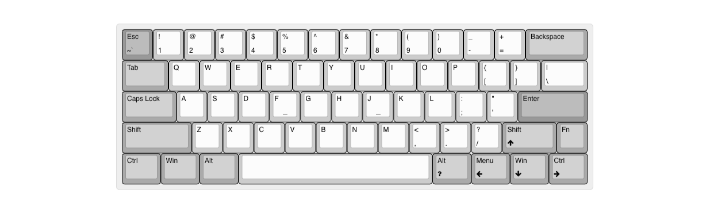
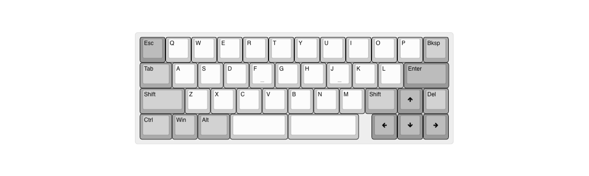
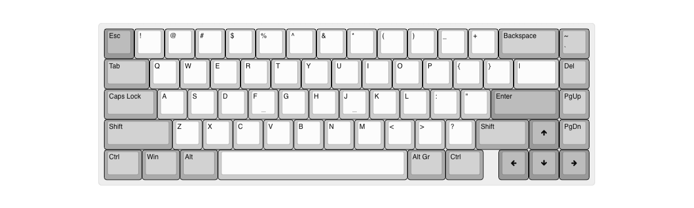
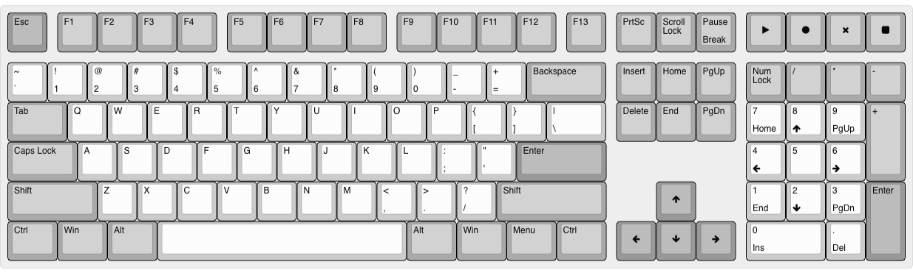

# Welcome to tecsmith.design

## <i class="far fa-question-circle"></i> About

On this site you will find Vino Rodrigues' custom keyboard and home automation device designs.

The intent here is one of education. My hope is that you will be inspired to create your own electronics and embeded software products.

All my personal *(non-commissioned)* projects will be hosted here *(or rather on Github)*.

The tools I use currently are:

- EAGLE CAD, for electronics schematics and PCB design
- QMK, for firmware builds
- Fusion 360, for case design

## <i class="far fa-comment"></i> Contact me

#### If it's for keyboards

Please reach out to me on Discord on either the [**QMK** server](https://discord.gg/qmk) or the [**Keyboard Atelier** server](https://discord.gg/b7vwhHS).

DM me (<code>@vinorodrigues</code>), and be direct: say what you want and a brief elaboration. And FHS, [don't ask to ask](https://dontasktoask.com).

> <i class="fas fa-exclamation-triangle"></i> **BE WARNED:**  I seldom do *"commissions"*, and when I do, they're *<ins>usually</ins>* pro-bono, and with the condition that it's open-source.

#### If it's for home/<abbr title="Small and Medium-sized Business">SMB</abbr> automation

Reach me by visiting the contact page on [tecsmith.au](https://tecsmith.au).

## <i class="far fa-keyboard"></i> The goodies

### <i class="far fa-microchip"></i> PCBs

| Project Name | Layout | Extraordinary feature | Availability | Status |
|---|:---:|---|---|---|
| VR61 Keyboard PCB |  | <ul><li>SparkFun MicroMod</li></ul> | Open Source   [tecsmith/vr61-keyboard-pcb](https://github.com/tecsmith/vr61-keyboard-pcb) | <i class="text-success fa-solid fa-traffic-light"></i> **OK** |
| VR42 Keyboard PCB |  | <ul><li>HS-USB <i>8MHz polling</i></li></ul> | Open Source   [tecsmith/vr42-keyboard-pcb](https://github.com/tecsmith/vr42-keyboard-pcb)| <i class="text-warning fa-solid fa-traffic-light"></i> **UNDER TESTING**   Design completed   In testing phase |
| VR99 Keyboard PCB |  | <ul><li>Direct key scanning <i>(no matrix)</i><li>Charliepixel per-key RGB</li></li></ul> | Open Source   [tecsmith/vr99-keyboard-pcb](https://github.com/tecsmith/vr99-keyboard-pcb) | <i class="text-danger fa-solid fa-traffic-light"></i> **UNDER DEVELOPMENT**   Design completed   NOT prototyped   NOT tested |
| VR44 Keyboard PCB   *a.k.a. "Companion"* |  | <ul><li>RealTime Clock</li><li>Calc mode</li><li>3 Amp 3-port USB 2 hub</li></ul> | Open Source   [tecsmith/vr44-keyboard-pcb](https://github.com/tecsmith/vr44-keyboard-pcb) | <i class="text-danger fa-solid fa-traffic-light"></i> **UNDER DEVELOPMENT**   Ideation stage only |
| VR64 Keyboard PCB |  | <ul><li><abbr title="Hall Effect">HE</abbr> switches</li></ul> | Open Source   [tecsmith/vr64-keyboard-pcb](https://github.com/tecsmith/vr64-keyboard-pcb) | <i class="text-danger fa-solid fa-traffic-light"></i> **UNSTARTED** |
| VR68 Keyboard PCB |  | <ul><li>Topre switches</li></ul> | Open Source   [tecsmith/vr68-keyboard-pcb](https://github.com/tecsmith/vr68-keyboard-pcb) | <i class="text-danger fa-solid fa-traffic-light"></i> **UNSTARTED** |
| VR108 Keyboard PCB |  | <ul><li>Low profile "Choc" switches</li></ul> | Open Source   *-* | <i class="text-danger fa-solid fa-traffic-light"></i> **UNSTARTED** |

### Firmware

| Project Name | Availability | Status |
|---|---|---|
| VR61 Keyboard firmware | Open Source   [tecsmith/vr61-keyboard-qmk](https://github.com/tecsmith/vr61-keyboard-qmk) | <i class="text-success fa-solid fa-traffic-light"></i> **OK**   Not merged to up-stream / won't |

### Cases

| Project Name | Layout | Availability | Status |
|---|:---:|---|---|
| VR42 Keyboard Case |  | Open Source   [tecsmith/vr42-keyboard-case](https://github.com/tecsmith/vr42-keyboard-case) | <i class="text-warning fa-solid fa-traffic-light"></i> **UNDER TESTING**   Design completed   In testing phase |
