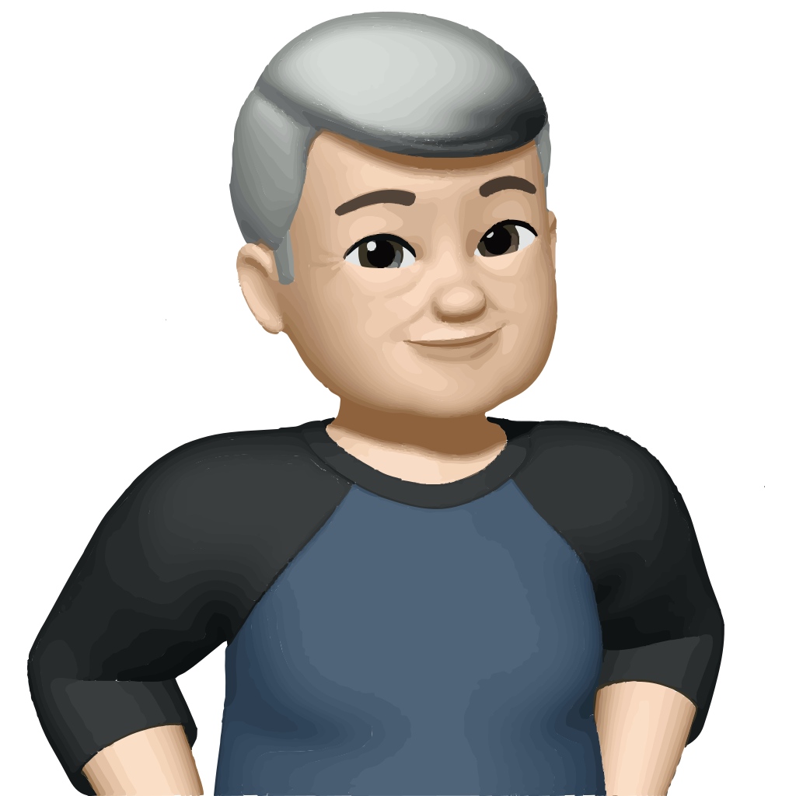
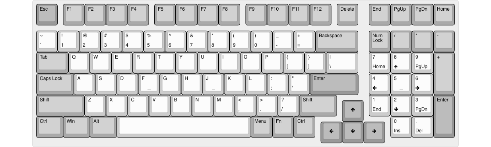
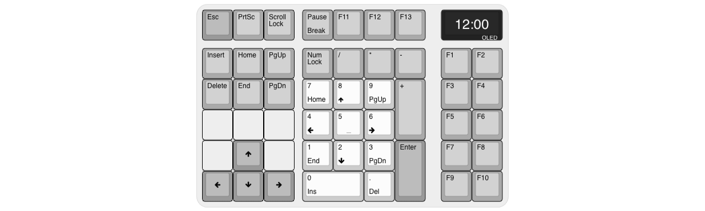
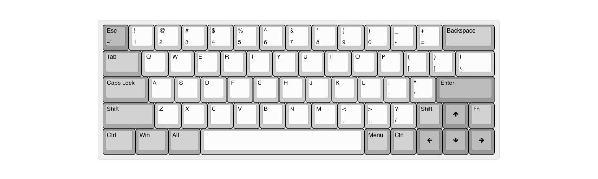
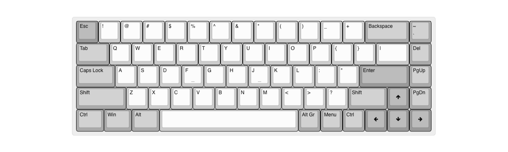
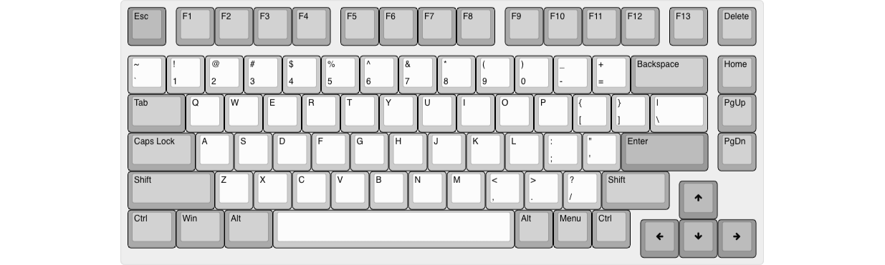

# Welcome to tecsmith.design

## <i class="far fa-question-circle"></i> About

On this site you will find Silvino Rodrigues' custom keyboard and home automation device designs.

The intent here is one of education. My hope is that you will be inspired to create your own electronics and embeded software products.

All my personal *(non-commissioned)* projects will be hosted here *(or rather on Github)*.

The tools currently used are:

- EAGLE CAD, for electronics schematics and PCB design
- VSCode
  - with QMK, for keyboard firmware builds
  - with PlatformIO, for automation firmware builds
- Fusion 360, for case design

## <i class="far fa-comment"></i> Contact me

Reach me by visiting the contact page on [tecsmith.au](https://tecsmith.au).

## <i class="far fa-keyboard"></i> The goodies

### <i class="fas fa-microchip"></i> PCBs

| Project Name | Layout | Extraordinary feature | Availability | Status |
|---|:---:|---|---|---|
| SR61 Keyboard PCB | [{: .img-kb }](assets/img/sr61-kb.png "SR61 'MicroMod' Keyboard"){: .modal-link} | ⦁ SparkFun MicroMod processor board | Open Source   [tecsmith/sr61-keyboard-pcb](https://github.com/tecsmith/sr61-keyboard-pcb) | <i class="text-success fas fa-traffic-light"></i> **OK** |
| SR42 Keyboard PCB | [{: .img-kb }](assets/img/sr42-kb.png "SR42 '40%' Keyboard"){: .modal-link} | ⦁ Direct key scanning *(no matrix)* ⦁ HS-USB *(8 MHz polling)* | Open Source   [tecsmith/sr42-keyboard-pcb](https://github.com/tecsmith/sr42-keyboard-pcb)| <i class="text-warning fas fa-traffic-light"></i> **UNDER TESTING**   Design completed   In testing phase |
| SR99 Keyboard PCB | [{: .img-kb }](assets/img/sr99-kb.png "SR99 '980' Keyboard"){: .modal-link} | ⦁ Charliepixel per-key RGB | Open Source   [tecsmith/sr99-keyboard-pcb](https://github.com/tecsmith/sr99-keyboard-pcb) | <i class="text-danger fas fa-traffic-light"></i> **UNDER DEVELOPMENT**   Design completed   NOT prototyped   NOT tested |
| SR01 Keyboard PCB   *"WHID"* | [{: .img-kb }](assets/img/sr01-kb.png "SR01 'One-Key' Keyboard"){: .modal-link} | ⦁ One key sampler ⦁ XIAO ESP32 Wireless module | Open Source   [tecsmith/sr01-keyboard-pcb](https://github.com/tecsmith/sr01-keyboard-pcb) | <i class="text-danger fas fa-traffic-light"></i> **UNDER DEVELOPMENT**   Ideation stage only |
| SR44 Keyboard PCB   *a.k.a. "Companion"* | [{: .img-kb }](assets/img/sr44-kb.png "SR44 'Companion' Keyboard"){: .modal-link} | ⦁ RealTime Clock ⦁ Calc mode ⦁ 3 Amp 3-port USB 2 hub | Open Source   [tecsmith/sr44-keyboard-pcb](https://github.com/tecsmith/sr44-keyboard-pcb) | <i class="text-danger fas fa-traffic-light"></i> **UNDER DEVELOPMENT**   Ideation stage only |
| SR64 Keyboard PCB | [{: .img-kb }](assets/img/sr64-kb.png "SR64 'HE' Keyboard"){: .modal-link} | ⦁ <abbr title="Hall Effect">HE</abbr> switches | Open Source   [tecsmith/sr64-keyboard-pcb](https://github.com/tecsmith/sr64-keyboard-pcb) | <i class="text-danger fas fa-traffic-light"></i> **UNSTARTED** |
| SR68 Keyboard PCB | [{: .img-kb }](assets/img/sr68-kb.png "SR68 'EC' Keyboard"){: .modal-link} | ⦁ EC (Topr&eacute;-like "Electro Capacitive") switches | Open Source   [tecsmith/sr68-keyboard-pcb](https://github.com/tecsmith/sr68-keyboard-pcb) | <i class="text-danger fas fa-traffic-light"></i> **UNSTARTED** |
| SR82 Keyboard PCB | [{: .img-kb }](assets/img/sr82-kb.png "SR82 Keyboard"){: .modal-link} | ⦁ ¿? | &mdash; ¿? &mdash; | <i class="text-danger fas fa-traffic-light"></i> **UNSTARTED** |
| SR108 Keyboard PCB | [{: .img-kb }](assets/img/sr108-kb.png "SR108 'Full-size' Keyboard"){: .modal-link} | ⦁ ¿? | &mdash; ¿? &mdash; | <i class="text-danger fas fa-traffic-light"></i> **UNSTARTED** |
| SR89 TKL Keyboard PCB | [{: .img-kb }](assets/img/sr89-kb.png "SR89 TKL Keyboard"){: .modal-link} | ⦁ <u>Open Source</u> Wireless Tri-mode *(?)* ⦁ Magnetic snap-on with SR21 | &mdash; ¿? &mdash; | <i class="text-danger fas fa-traffic-light"></i> **UNSTARTED** |
| SR21 Keyboard PCB | [{: .img-kb }](assets/img/sr21-kb.png "SR21 Num-pad Keyboard"){: .modal-link} | ⦁ <u>Open Source</u> Wireless Tri-mode *(?)* ⦁ Magnetic snap-on with SR89 | &mdash; ¿? &mdash; | <i class="text-danger fas fa-traffic-light"></i> **UNSTARTED** |
| SR47 Keyboard PCB   "Planck"-clone | [{: .img-kb }](assets/img/sr47-kb.png "SR47 Ortho-linier Keyboard"){: .modal-link} | ⦁ ¿?  | &mdash; ¿? &mdash; | <i class="text-danger fas fa-traffic-light"></i> **UNSTARTED** |
{: .table .table-striped }

### <i class="far fa-file"></i> Firmware

| Project Name | Availability | Status |
|---|---|---|
| SR61 Keyboard firmware | Open Source   [tecsmith/sr61-keyboard-qmk](https://github.com/tecsmith/sr61-keyboard-qmk) | <i class="text-success fas fa-traffic-light"></i> **OK**   Not merged to up-stream / won't |
{: .table .table-striped }

### <i class="fas fa-cube"></i> Cases

| Project Name | Layout | Availability | Status |
|---|:---:|---|---|
| SR42 Keyboard Case |  | Open Source   [tecsmith/sr42-keyboard-case](https://github.com/tecsmith/sr42-keyboard-case) | <i class="text-warning fas fa-traffic-light"></i> **UNDER TESTING**   Design completed   In testing phase |
{: .table .table-striped }
