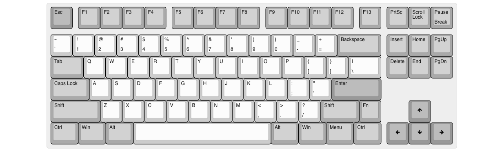
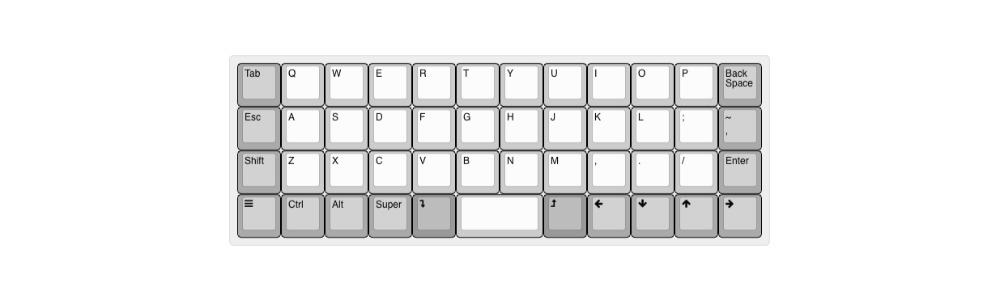

# Welcome to tecsmith.design

## <i class="far fa-question-circle"></i> About

On this site you will find Silvino Rodrigues' custom keyboard and home automation device designs.

The intent here is one of education. My hope is that you will be inspired to create your own electronics and embeded software products.

All my personal *(non-commissioned)* projects will be hosted here *(or rather on Github)*.

The tools currently used are:

- EAGLE CAD, for electronics schematics and PCB design
- VSCode
  - with QMK, for keyboard firmware builds
  - with PlatformIO, for automation firmware builds
- Fusion 360, for case design

## <i class="far fa-comment"></i> Contact me

Reach me by visiting the contact page on [tecsmith.au](https://tecsmith.au).

## <i class="far fa-keyboard"></i> The goodies

### <i class="fas fa-microchip"></i> PCBs

| Project Name | Layout | Extraordinary feature | Availability | Status |
|---|:---:|---|---|---|
| VR61 Keyboard PCB | [{: .img-kb }](assets/img/vr61-kb.png "VR61 'MicroMod' Keyboard"){: .modal-link} | ⦁ SparkFun MicroMod processor board | Open Source   [tecsmith/vr61-keyboard-pcb](https://github.com/tecsmith/vr61-keyboard-pcb) | <i class="text-success fas fa-traffic-light"></i> **OK** |
| VR42 Keyboard PCB | [{: .img-kb }](assets/img/vr42-kb.png "VR42 '40%' Keyboard"){: .modal-link} | ⦁ Direct key scanning *(no matrix)* ⦁ HS-USB *(8 MHz polling)* | Open Source   [tecsmith/vr42-keyboard-pcb](https://github.com/tecsmith/vr42-keyboard-pcb)| <i class="text-warning fas fa-traffic-light"></i> **UNDER TESTING**   Design completed   In testing phase |
| VR99 Keyboard PCB | [{: .img-kb }](assets/img/vr99-kb.png "VR99 '980' Keyboard"){: .modal-link} | ⦁ Charliepixel per-key RGB | Open Source   [tecsmith/vr99-keyboard-pcb](https://github.com/tecsmith/vr99-keyboard-pcb) | <i class="text-danger fas fa-traffic-light"></i> **UNDER DEVELOPMENT**   Design completed   NOT prototyped   NOT tested |
| VR01 Keyboard PCB   *"WHID"* | [{: .img-kb }](assets/img/vr01-kb.png "VR01 'One-Key' Keyboard"){: .modal-link} | ⦁ One key sampler ⦁ XIAO ESP32 Wireless module | Open Source   [tecsmith/vr01-keyboard-pcb](https://github.com/tecsmith/vr01-keyboard-pcb) | <i class="text-danger fas fa-traffic-light"></i> **UNDER DEVELOPMENT**   Ideation stage only |
| VR44 Keyboard PCB   *a.k.a. "Companion"* | [{: .img-kb }](assets/img/vr44-kb.png "VR44 'Companion' Keyboard"){: .modal-link} | ⦁ RealTime Clock ⦁ Calc mode ⦁ 3 Amp 3-port USB 2 hub | Open Source   [tecsmith/vr44-keyboard-pcb](https://github.com/tecsmith/vr44-keyboard-pcb) | <i class="text-danger fas fa-traffic-light"></i> **UNDER DEVELOPMENT**   Ideation stage only |
| VR64 Keyboard PCB | [{: .img-kb }](assets/img/vr64-kb.png "VR64 'HE' Keyboard"){: .modal-link} | ⦁ <abbr title="Hall Effect">HE</abbr> switches | Open Source   [tecsmith/vr64-keyboard-pcb](https://github.com/tecsmith/vr64-keyboard-pcb) | <i class="text-danger fas fa-traffic-light"></i> **UNSTARTED** |
| VR68 Keyboard PCB | [{: .img-kb }](assets/img/vr68-kb.png "VR68 'EC' Keyboard"){: .modal-link} | ⦁ Topre0like switches | Open Source   [tecsmith/vr68-keyboard-pcb](https://github.com/tecsmith/vr68-keyboard-pcb) | <i class="text-danger fas fa-traffic-light"></i> **UNSTARTED** |
| VR82 Keyboard PCB | [{: .img-kb }](assets/img/vr82-kb.png "VR82 Keyboard"){: .modal-link} | ⦁ ¿? | &mdash; ¿? &mdash; | <i class="text-danger fas fa-traffic-light"></i> **UNSTARTED** |
| VR108 Keyboard PCB | [{: .img-kb }](assets/img/vr108-kb.png "VR108 'Full-size' Keyboard"){: .modal-link} | ⦁ ¿? | &mdash; ¿? &mdash; | <i class="text-danger fas fa-traffic-light"></i> **UNSTARTED** |
| VR89 TKL Keyboard PCB | [{: .img-kb }](assets/img/vr89-kb.png "VR89 TKL Keyboard"){: .modal-link} | ⦁ <u>Open Source</u> Wireless Tri-mode *(?)* ⦁ Magnetic span-on with VR21 | &mdash; ¿? &mdash; | <i class="text-danger fas fa-traffic-light"></i> **UNSTARTED** |
| VR21 Keyboard PCB | [{: .img-kb }](assets/img/vr21-kb.png "VR21 Num-pad Keyboard"){: .modal-link} | ⦁ <u>Open Source</u> Wireless Tri-mode *(?)* ⦁ Magnetic span-on with VR89 | &mdash; ¿? &mdash; | <i class="text-danger fas fa-traffic-light"></i> **UNSTARTED** |
| VR47 Keyboard PCB   "Planck"-clone | [{: .img-kb }](assets/img/vr47-kb.png "VR47 Ortho-linier Keyboard"){: .modal-link} | ⦁ ¿?  | &mdash; ¿? &mdash; | <i class="text-danger fas fa-traffic-light"></i> **UNSTARTED** |
{: .table .table-striped }

### <i class="far fa-file"></i> Firmware

| Project Name | Availability | Status |
|---|---|---|
| VR61 Keyboard firmware | Open Source   [tecsmith/vr61-keyboard-qmk](https://github.com/tecsmith/vr61-keyboard-qmk) | <i class="text-success fas fa-traffic-light"></i> **OK**   Not merged to up-stream / won't |
{: .table .table-striped }

### <i class="fas fa-cube"></i> Cases

| Project Name | Layout | Availability | Status |
|---|:---:|---|---|
| VR42 Keyboard Case |  | Open Source   [tecsmith/vr42-keyboard-case](https://github.com/tecsmith/vr42-keyboard-case) | <i class="text-warning fas fa-traffic-light"></i> **UNDER TESTING**   Design completed   In testing phase |
{: .table .table-striped }

